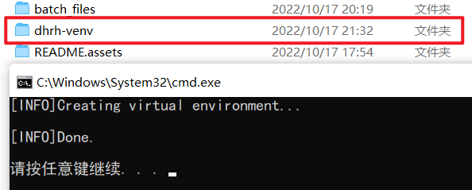

# 东南大学每日健康上报打卡助手（Windows 一键部署版） :alarm_clock:

*@分支作者：Gol3vka*  \
*@原项目作者：XAKK*  \
*@原项目地址：<https://github.com/XAKK/SEU-health-reporting-helper.git>*

<br/>

:hand: **稍等!**  \
如果您有在其他平台（Linux、Docker）上运行的需求，或在一键部署过程中遇到问题，可以跳转到这里噢！

[:door: 传送门](https://github.com/Golevka2001/SEU-Daily-Health-Reporting-Helper)

---

这是一个每日健康上报自动化脚本，在正确配置之后，可以实现每日自动打卡，支持同时为多位用户上报（分支功能），并通过邮件告知打卡结果。

此版本将 *创建虚拟环境、安装依赖包、安装 ChromeDriver* 等一系列操作通过脚本自动完成，一键完成环境配置，新手友好。

请平日自觉打卡，建议将自动打卡脚本作为兜底。默认上报体温为 **36.2℃** 至 **36.7℃** 。

:warning: **出现发烧等异常状况时，请务必在打卡脚本运行前手动申报健康状况**，以免造成信息错报。

祝各位用户身体健康。:wink:

:speech_balloon: 在部署、使用过程中遇到问题可以在 GitHub 页面提 Issues 或通过邮件发送您的问题。


---

## 目录

- [东南大学每日健康上报打卡助手（Windows 一键部署版） :alarm_clock:](#东南大学每日健康上报打卡助手windows-一键部署版-alarm_clock)
  - [目录](#目录)
  - [安全性](#安全性)
  - [使用说明](#使用说明)
    - [基本运行环境](#基本运行环境)
      - [Python](#python)
      - [Google Chrome](#google-chrome)
    - [一键配置虚拟环境及依赖](#一键配置虚拟环境及依赖)
    - [新建配置文件](#新建配置文件)
    - [运行](#运行)
    - [配置定时任务（可选）](#配置定时任务可选)
  - [更新日志 :book:](#更新日志-book)

## 安全性

此程序不会收集、上传在运行中所使用到的任何个人信息另作它用，包括邮箱地址、登录密码等。这些个人信息仅由用户写入本地配置文件中，仅用于健康上报页面和邮箱的登录。

:warning: **切记**：请不要将写有隐私信息的配置文件发送给任何人。

## 使用说明

### 基本运行环境

#### Python

本项目的运行需要 Python 支持。

在命令行中输入 python ，若有版本信息显示，则已有 Python 解释器，跳过。若显示为未知命令，则需要安装 Python 解释器。

最简单的方式是在 Microsoft Store 中搜索“Python”，点击安装。您也可以在网上查找其他方式。

#### Google Chrome

本项目的运行需要 Google Chrome 和 Chrome Driver 支持。

需要您在进行以下操作前安装好 Google Chrome，您可能需要 [Google Chrome 网络浏览器](https://www.google.cn/chrome/)。

无版本限制，但建议使用官方的安装版本。对于非官方版本以及便携版，可能会在 Chrome Driver 安装脚本中引发错误，包括但不限于**路径、版本的获取**。

### 一键配置虚拟环境及依赖

找到目录下的 ```prepare(Run as Admin).bat``` 文件，点击 **右键 - 以管理员身份运行**。

:warning: **若直接双击运行，则可能会由于权限不足导致多处操作失败。**


接下来会自动完成虚拟环境的创建。

命令行窗口中无报错信息，且在目录下出现名为 **dhrh-venv** 的文件夹，表示虚拟环境创建成功，在命令行窗口中按任意键进入下一步。



接下来会自动完成所需包的安装。

命令行窗口中无报错信息（图中pip的更新信息可忽视），表示所需包均已安装成功，在命令行窗口中按任意键进入下一步。


接下来会自动完成对应版本的 Chrome Driver 安装。

此步骤中可能出现的错误：

- **提示 *Can not find chrome installed in your system***
  无法从注册表中获取到 Google Chrome 的安装信息，可能是由于便携版或非官方版本，访问 [ChromeDriver 发布页面](https://chromedriver.storage.googleapis.com/index.html) 或 [ChromeDriver 镜像站](https://registry.npmmirror.com/binary.html?path=chromedriver/)，选择与本地浏览器相匹配的版本下载。

- **提示 *Can not get chrome version***
  无法从注册表中获取到 Google Chrome 的版本信息，也可能是由于便携版或非官方版本，请在查看版本后手动输入（注意确保格式的正确，比如：106.0.5249.119）

- **提示 *Can not find matched version***
  无法从发布页面中找到与 Google Chrome 版本匹配的 Chrome Driver，请确认版本号是否正确，在弹出的页面中找到匹配的版本下载

命令行窗口中无报错信息，表示 Chrome Driver 已安装成功。复制下 ```chromedriver.exe``` 的路径备用，在命令行中输入 ```Y``` 确认删除下载产生的临时文件。


:tada: :tada: :tada: **至此，所需的环境、包、依赖程序已安装完毕。**

### 新建配置文件

目录下的 `config_demo.yml` 是演示配置文件，可以在此基础上修改，并将文件重命名为 `config.yml` 。

或直接在当前目录下新建 `config.yml` ， 按照以下格式正确写入内容，相关字段修改为自己的一卡通号、密码、邮箱等。

**还记得刚才复制的路径吗？粘贴在 ```chrome_driver_path``` 这里噢！注意要用双反斜杠。**

```yaml
#################### 必填 ###################
## chromedriver 可执行文件路径
# 仅为示例，请根据自己设备上的路径进行填写。Windows下注意要用双反斜杠。
chrome_driver_path: "C:\\Program Files\\Google\\Chrome\\Application\\chromedriver.exe"

## 一卡通号（将 22000000x 替换为您的一卡通号）
# 如需要添加打卡账号，请按照此格式（- "xxx"）向下添加。
# 如只有一个用户，请删除多余的行，下同。【注意保持几个列表项数一致，且彼此匹配】
user_id:
    - "220000000"
    - "220000001"

## 统一身份认证密码（将 ****** 替换为统一身份认证密码）
password:
    - "******"
    - "******"

#################### 可选 ####################
## 是否需要发送邮件通知打卡结果（yes/no）
notification:
    - "no"
    - "no"

## 只有尝试打卡失败后，才发送邮件（yes/no）
notify_failure_only:
    - "no"
    - "no"

## 发送打卡状态的邮箱地址（将 USER_NAME@seu.edu.cn 替换为您的邮箱地址）
from_addr: "USER_NAME@seu.edu.cn"

# 发送打卡状态的邮箱密码（将 ****** 替换为您的邮箱登录密码）
email_password: "******"

## 发送打卡状态的邮箱的 SMTP 服务器地址
#一般为 smtp.<邮箱后缀> 若不清楚可在网上查询所用邮箱的SMTP服务器地址
smtp_server: "smtp.seu.edu.cn"

## 发送打卡状态的邮箱的 smtp 服务器端口号
# 一般为25，为保证发送成功率，建议使用支持SSL协议的端口，具体端口号可在网上查询
port: 25

## 接收打卡状态的邮箱地址
to_addr:
    - "name1@example.com"
    - "name2@example.com"
```

### 运行

双击目录下的 ```run.bat```, 或在命令行中输入如下命令：

```powershell
run.bat
```

### 配置定时任务（可选）

借助一台在预定义时间处于运行状态的 Windows 机器，以及 Windows 任务计划程序，可以无人干预的情况下每日自动打卡。

**打开任务计划程序**：按下 `Win` + `R` ，输入 `taskschd.msc`


**创建任务**：右键【任务计划程序库】，点击【创建任务】


**常规**：

1. 输入名称
2. 将安全选项中的账户改为具有相关权限的账户
3. 选择【不管用户是否登录都要运行】
4. 勾选【使用最高权限运行】


**触发器**：

1. 点击【新建】
2. 将任务设置为【每天】执行
3. 配置随机延迟时间（可选）
4. 也可以根据自身需求定义多个触发器


**操作**：

1. 点击【新建】
2. 选择启动程序（项目目录下的 `run.bat` 脚本）


完成上面配置后，便新建了一个计划任务。

## 更新日志 :book:

> 2022.03.05以及之前部分来自原项目，之后部分为分支更新内容

**2022.10.17:**

1. 新增 Windows 一键部署版本，将以下操作通过脚本实现：创建虚拟环境、安装依赖包、安装与浏览器版本相对应的 ChromeDriver

**2022.09.29:**

1. 移除旧版配置文件 ```personal_information.py``` ；
2. 修改邮件发送部分代码。

**2022.09.26:**

1. 支持在一个脚本中为多用户打卡。在需要为多个用户执行操作时，不需要再将文件复制多份以及配置多个定时任务；
2. 修改配置文件部分字段为列表类型。

**2022.03.05:**

1. 正常体温数据随机化，取值范围为 [36.2, 36.7]；
2. 配置文件格式切换至 yaml，老式配置文件（personal_information.py）支持暂时保留;
3. 增加对 Docker 的支持。

**2022.03.04:**

1. 增加对 Linux 的支持。

**2021.11.16：**

1. 增加配置选项：是否需要通过邮件发送打卡结果;
2. 增加配置选项：是否只有在打卡失败时进行通知。
